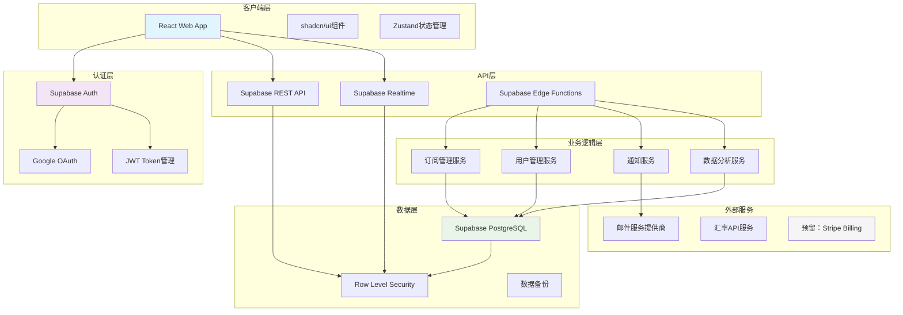
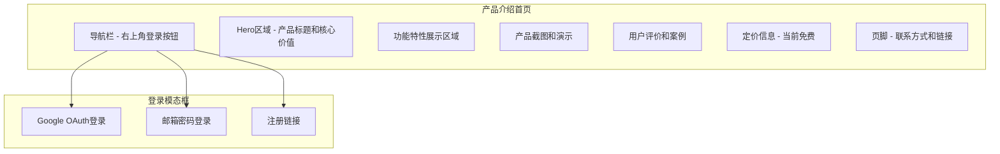
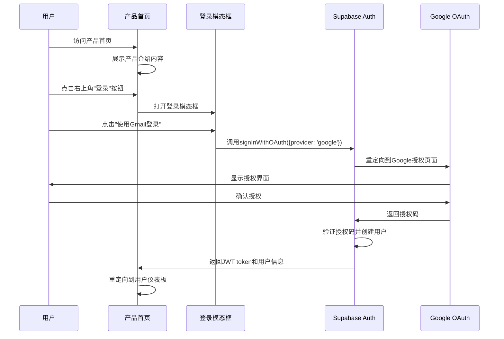

# SaaS平台改造设计文档

## Overview

本设计文档描述了将现有的单用户订阅管理系统改造为多租户SaaS平台的技术架构和实现方案。改造后的系统将使用Supabase作为后端服务，支持Google OAuth优先的用户认证、多租户数据隔离、订阅计费系统，同时保留所有现有功能。

### 核心改造目标

1. **多租户架构**：从单用户系统转变为支持多用户的SaaS平台
2. **现代化认证**：集成Supabase Auth，优先支持Gmail登录
3. **数据库迁移**：从SQLite迁移到Supabase PostgreSQL
4. **免费订阅模式**：初期为所有用户提供免费访问，预留后续付费功能扩展
5. **功能保留**：确保所有现有功能在新架构下正常工作
6. **Web优先**：专注于Web端用户体验优化

### 技术栈变更

**现有技术栈**：
- 前端：React + TypeScript + Vite + Tailwind CSS + shadcn/ui
- 后端：Node.js + Express
- 数据库：SQLite + better-sqlite3
- 状态管理：Zustand

**新技术栈**：
- 前端：React + TypeScript + Vite + Tailwind CSS + shadcn/ui（保持不变）
- 后端：Supabase（替代Node.js + Express）
- 数据库：Supabase PostgreSQL + RLS（替代SQLite）
- 认证：Supabase Auth + Google OAuth
- 支付：预留Stripe Billing集成（后续功能）
- 状态管理：Zustand（保持不变）
- 邮件服务：Supabase Edge Functions + 第三方邮件服务

## Architecture

### 整体架构图



### 多租户架构设计

#### 数据隔离策略
使用Supabase的Row Level Security (RLS)实现租户级数据隔离：

```sql
-- 启用RLS的示例策略
CREATE POLICY "用户只能访问自己的订阅数据"
ON subscriptions FOR ALL
TO authenticated
USING (user_id = auth.uid())
WITH CHECK (user_id = auth.uid());
```

#### 租户识别机制
- 使用Supabase Auth的`auth.uid()`作为租户标识符
- 所有业务表都包含`user_id`字段关联到`auth.users`表
- RLS策略自动过滤数据，确保用户只能访问自己的数据

### 用户界面架构

#### 产品介绍首页设计
产品首页将作为用户的第一接触点，展示完整的产品价值和功能介绍：

**首页布局结构**：


**首页设计要求**：
- 使用现代化的Tailwind CSS设计
- 响应式布局，支持移动端和桌面端
- 渐变背景和精美的视觉效果
- 清晰的产品功能展示
- 突出免费使用的优势
- 简洁优雅的登录入口

#### 认证架构

#### Google OAuth集成流程


#### 认证状态管理
- 使用Supabase Auth的会话管理
- JWT token自动刷新机制
- 支持持久化登录状态
- 安全的token存储和传输
- 首页访问无需认证，仅展示产品信息

## Components and Interfaces

### 前端组件架构

#### 产品首页组件
```typescript
// 产品首页组件
interface ProductLandingPageProps {
  onLoginClick?: () => void;
  features: ProductFeature[];
  testimonials: Testimonial[];
}

// Hero区域组件
interface HeroSectionProps {
  title: string;
  subtitle: string;
  ctaText: string;
  onCtaClick: () => void;
}

// 功能展示组件
interface FeatureShowcaseProps {
  features: ProductFeature[];
  layout: 'grid' | 'list';
}

// 产品截图组件
interface ProductScreenshotProps {
  images: ScreenshotImage[];
  autoPlay?: boolean;
}
```

#### 认证相关组件
```typescript
// 登录模态框组件
interface LoginModalProps {
  isOpen: boolean;
  onClose: () => void;
  onSuccess?: (user: User) => void;
  onError?: (error: AuthError) => void;
}

// Google OAuth按钮组件
interface GoogleAuthButtonProps {
  loading?: boolean;
  disabled?: boolean;
  children?: React.ReactNode;
  variant?: 'primary' | 'secondary';
}

// 导航栏组件
interface NavigationBarProps {
  onLoginClick: () => void;
  isAuthenticated?: boolean;
  user?: User;
}
```

#### 订阅管理组件
```typescript
// 订阅计划选择组件
interface SubscriptionPlanSelectorProps {
  plans: SubscriptionPlan[];
  currentPlan?: SubscriptionPlan;
  onPlanSelect: (plan: SubscriptionPlan) => void;
  loading?: boolean;
}

// 使用配额显示组件
interface UsageQuotaProps {
  currentUsage: number;
  limit: number;
  feature: string;
  showUpgradePrompt?: boolean;
}
```

#### 管理后台组件
```typescript
// 用户管理组件
interface UserManagementProps {
  users: User[];
  onUserAction: (userId: string, action: UserAction) => void;
  pagination: PaginationProps;
}

// 系统监控组件
interface SystemMonitoringProps {
  metrics: SystemMetrics;
  alerts: Alert[];
  refreshInterval?: number;
}
```

### API接口设计

#### Supabase客户端配置
```typescript
// Supabase客户端初始化
const supabaseUrl = process.env.NEXT_PUBLIC_SUPABASE_URL!;
const supabaseAnonKey = process.env.NEXT_PUBLIC_SUPABASE_ANON_KEY!;

export const supabase = createClient(supabaseUrl, supabaseAnonKey, {
  auth: {
    autoRefreshToken: true,
    persistSession: true,
    detectSessionInUrl: true
  }
});
```

#### 订阅管理API
```typescript
// 订阅服务接口
interface SubscriptionService {
  // 获取用户订阅
  getUserSubscriptions(): Promise<Subscription[]>;
  
  // 创建订阅
  createSubscription(data: CreateSubscriptionData): Promise<Subscription>;
  
  // 更新订阅
  updateSubscription(id: string, data: UpdateSubscriptionData): Promise<Subscription>;
  
  // 删除订阅
  deleteSubscription(id: string): Promise<void>;
  
  // 获取订阅统计
  getSubscriptionStats(): Promise<SubscriptionStats>;
}
```

#### 用户管理API
```typescript
// 用户管理服务接口
interface UserManagementService {
  // 获取用户订阅计划
  getUserSubscription(userId: string): Promise<UserSubscription>;
  
  // 自动为新用户分配免费计划
  assignDefaultPlan(userId: string): Promise<UserSubscription>;
  
  // 检查用户功能权限
  checkFeatureAccess(userId: string, feature: string): Promise<boolean>;
  
  // 获取用户使用统计
  getUserUsageStats(userId: string): Promise<UsageStats>;
}

// 预留：支付服务接口（后续Stripe集成）
interface PaymentService {
  // 创建Stripe客户
  createStripeCustomer(userId: string): Promise<StripeCustomer>;
  
  // 创建订阅
  createSubscription(customerId: string, priceId: string): Promise<StripeSubscription>;
  
  // 处理webhook事件
  handleWebhook(event: StripeEvent): Promise<void>;
  
  // 获取发票
  getInvoices(customerId: string): Promise<Invoice[]>;
}
```

### Edge Functions设计

#### 邮件通知函数
```typescript
// 邮件通知Edge Function
export const sendNotificationEmail = async (
  request: Request
): Promise<Response> => {
  const { type, userId, data } = await request.json();
  
  // 验证用户权限
  const user = await getUser(userId);
  if (!user) {
    return new Response('Unauthorized', { status: 401 });
  }
  
  // 根据类型发送不同邮件
  switch (type) {
    case 'welcome':
      await sendWelcomeEmail(user, data);
      break;
    case 'subscription_expiry':
      await sendExpiryReminder(user, data);
      break;
    case 'payment_failed':
      await sendPaymentFailedNotification(user, data);
      break;
  }
  
  return new Response('OK');
};
```

#### 用户注册处理函数
```typescript
// 用户注册处理Edge Function
export const handleUserRegistration = async (
  request: Request
): Promise<Response> => {
  const { userId } = await request.json();
  
  try {
    // 自动为新用户分配免费计划
    await assignDefaultSubscriptionPlan(userId);
    
    // 创建用户配置
    await createUserProfile(userId);
    
    // 发送欢迎邮件
    await sendWelcomeEmail(userId);
    
    return new Response(JSON.stringify({ success: true }));
  } catch (error) {
    console.error('User registration failed:', error);
    return new Response('Registration failed', { status: 500 });
  }
};

// 预留：订阅处理函数（后续付费功能）
export const processSubscriptionChange = async (
  request: Request
): Promise<Response> => {
  const { userId, action, subscriptionData } = await request.json();
  
  // 验证用户权限和配额
  const canPerformAction = await checkUserQuota(userId, action);
  if (!canPerformAction) {
    return new Response('Quota exceeded', { status: 403 });
  }
  
  // 处理订阅变更
  const result = await handleSubscriptionChange(userId, action, subscriptionData);
  
  return new Response(JSON.stringify(result));
};
```

## Data Models

### 数据库架构设计

#### 用户和认证相关表
```sql
-- Supabase Auth自动管理的用户表
-- auth.users (由Supabase管理)

-- 用户配置表
CREATE TABLE user_profiles (
    id UUID PRIMARY KEY REFERENCES auth.users(id) ON DELETE CASCADE,
    display_name TEXT,
    avatar_url TEXT,
    timezone TEXT DEFAULT 'UTC',
    language TEXT DEFAULT 'zh-CN',
    created_at TIMESTAMPTZ DEFAULT NOW(),
    updated_at TIMESTAMPTZ DEFAULT NOW()
);

-- 启用RLS
ALTER TABLE user_profiles ENABLE ROW LEVEL SECURITY;

-- RLS策略
CREATE POLICY "用户只能访问自己的配置"
ON user_profiles FOR ALL
TO authenticated
USING (id = auth.uid())
WITH CHECK (id = auth.uid());
```

#### 订阅计划表（预留扩展）
```sql
-- 订阅计划表（初期只有免费计划，预留付费计划扩展）
CREATE TABLE subscription_plans (
    id UUID PRIMARY KEY DEFAULT gen_random_uuid(),
    name TEXT NOT NULL,
    description TEXT,
    price_monthly DECIMAL(10,2) DEFAULT 0,
    price_yearly DECIMAL(10,2) DEFAULT 0,
    features JSONB NOT NULL DEFAULT '{}',
    limits JSONB NOT NULL DEFAULT '{}',
    stripe_price_id_monthly TEXT, -- 预留字段
    stripe_price_id_yearly TEXT,  -- 预留字段
    is_active BOOLEAN DEFAULT true,
    is_default BOOLEAN DEFAULT false,
    created_at TIMESTAMPTZ DEFAULT NOW(),
    updated_at TIMESTAMPTZ DEFAULT NOW()
);

-- 插入默认免费计划
INSERT INTO subscription_plans (name, description, features, limits, is_default) VALUES
('免费版', '完整功能，免费使用', 
 '{"all_current_features": true, "email_support": true}',
 '{"max_subscriptions": -1, "api_calls_per_hour": 1000}',
 true);

-- 预留付费计划（暂时不激活）
-- INSERT INTO subscription_plans (name, description, price_monthly, price_yearly, features, limits, is_active) VALUES
-- ('基础版', '更多功能，适合小团队', 9.99, 99.99,
--  '{"advanced_analytics": true, "priority_support": true, "data_export": true}',
--  '{"max_subscriptions": 100, "api_calls_per_hour": 5000}', false),
-- ('专业版', '全功能，适合企业用户', 29.99, 299.99,
--  '{"all_features": true, "dedicated_support": true, "custom_integrations": true}',
--  '{"max_subscriptions": -1, "api_calls_per_hour": 10000}', false);
```

#### 用户订阅关系表
```sql
-- 用户订阅表（初期所有用户自动获得免费计划）
CREATE TABLE user_subscriptions (
    id UUID PRIMARY KEY DEFAULT gen_random_uuid(),
    user_id UUID NOT NULL REFERENCES auth.users(id) ON DELETE CASCADE,
    plan_id UUID NOT NULL REFERENCES subscription_plans(id),
    stripe_subscription_id TEXT, -- 预留字段，后续Stripe集成使用
    status TEXT NOT NULL DEFAULT 'active' CHECK (status IN ('active', 'canceled', 'past_due', 'unpaid')),
    current_period_start TIMESTAMPTZ DEFAULT NOW(),
    current_period_end TIMESTAMPTZ, -- 免费计划可为NULL（永久有效）
    cancel_at_period_end BOOLEAN DEFAULT false,
    created_at TIMESTAMPTZ DEFAULT NOW(),
    updated_at TIMESTAMPTZ DEFAULT NOW()
);

-- 启用RLS
ALTER TABLE user_subscriptions ENABLE ROW LEVEL SECURITY;

-- RLS策略
CREATE POLICY "用户只能访问自己的订阅"
ON user_subscriptions FOR ALL
TO authenticated
USING (user_id = auth.uid())
WITH CHECK (user_id = auth.uid());
```

#### 业务数据表（保留现有结构）
```sql
-- 订阅管理表（保留现有结构，添加user_id）
CREATE TABLE subscriptions (
    id UUID PRIMARY KEY DEFAULT gen_random_uuid(),
    user_id UUID NOT NULL REFERENCES auth.users(id) ON DELETE CASCADE,
    name TEXT NOT NULL,
    plan TEXT NOT NULL,
    billing_cycle TEXT NOT NULL CHECK (billing_cycle IN ('monthly', 'yearly', 'quarterly')),
    next_billing_date DATE,
    last_billing_date DATE,
    amount DECIMAL(10, 2) NOT NULL,
    currency TEXT NOT NULL DEFAULT 'CNY',
    payment_method_id UUID NOT NULL,
    start_date DATE,
    status TEXT NOT NULL DEFAULT 'active' CHECK (status IN ('active', 'inactive', 'cancelled')),
    category_id UUID NOT NULL,
    renewal_type TEXT NOT NULL DEFAULT 'manual' CHECK (renewal_type IN ('auto', 'manual')),
    notes TEXT,
    website TEXT,
    created_at TIMESTAMPTZ DEFAULT NOW(),
    updated_at TIMESTAMPTZ DEFAULT NOW()
);

-- 启用RLS
ALTER TABLE subscriptions ENABLE ROW LEVEL SECURITY;

-- RLS策略
CREATE POLICY "用户只能访问自己的订阅数据"
ON subscriptions FOR ALL
TO authenticated
USING (user_id = auth.uid())
WITH CHECK (user_id = auth.uid());
```

#### 支付历史表
```sql
-- 支付历史表（保留现有结构，添加user_id）
CREATE TABLE payment_history (
    id UUID PRIMARY KEY DEFAULT gen_random_uuid(),
    user_id UUID NOT NULL REFERENCES auth.users(id) ON DELETE CASCADE,
    subscription_id UUID NOT NULL REFERENCES subscriptions(id) ON DELETE CASCADE,
    payment_date DATE NOT NULL,
    amount_paid DECIMAL(10, 2) NOT NULL,
    currency TEXT NOT NULL,
    billing_period_start DATE NOT NULL,
    billing_period_end DATE NOT NULL,
    status TEXT NOT NULL DEFAULT 'succeeded' CHECK (status IN ('succeeded', 'failed', 'refunded')),
    notes TEXT,
    created_at TIMESTAMPTZ DEFAULT NOW()
);

-- 启用RLS
ALTER TABLE payment_history ENABLE ROW LEVEL SECURITY;

-- RLS策略
CREATE POLICY "用户只能访问自己的支付历史"
ON payment_history FOR ALL
TO authenticated
USING (user_id = auth.uid())
WITH CHECK (user_id = auth.uid());
```

#### 分类和支付方式表
```sql
-- 分类表（添加user_id支持自定义分类）
CREATE TABLE categories (
    id UUID PRIMARY KEY DEFAULT gen_random_uuid(),
    user_id UUID REFERENCES auth.users(id) ON DELETE CASCADE,
    value TEXT NOT NULL,
    label TEXT NOT NULL,
    is_default BOOLEAN DEFAULT false,
    created_at TIMESTAMPTZ DEFAULT NOW(),
    updated_at TIMESTAMPTZ DEFAULT NOW(),
    UNIQUE(user_id, value)
);

-- 启用RLS
ALTER TABLE categories ENABLE ROW LEVEL SECURITY;

-- RLS策略
CREATE POLICY "用户可以访问默认分类和自己的分类"
ON categories FOR SELECT
TO authenticated
USING (is_default = true OR user_id = auth.uid());

CREATE POLICY "用户只能管理自己的分类"
ON categories FOR INSERT, UPDATE, DELETE
TO authenticated
USING (user_id = auth.uid())
WITH CHECK (user_id = auth.uid());
```

### 数据迁移策略

#### 从SQLite到Supabase的迁移步骤
1. **数据导出**：从现有SQLite数据库导出数据
2. **表结构创建**：在Supabase中创建新的表结构
3. **数据转换**：将单用户数据转换为多租户格式
4. **RLS配置**：为所有表启用Row Level Security
5. **数据验证**：验证迁移后的数据完整性

#### 迁移脚本示例
```typescript
// 数据迁移脚本
export async function migrateFromSQLite() {
  // 1. 读取SQLite数据
  const sqliteData = await readSQLiteData();
  
  // 2. 为每个用户创建租户数据
  for (const userData of sqliteData) {
    // 创建用户账户
    const user = await createSupabaseUser(userData.email);
    
    // 迁移订阅数据
    await migrateSubscriptions(user.id, userData.subscriptions);
    
    // 迁移支付历史
    await migratePaymentHistory(user.id, userData.paymentHistory);
    
    // 迁移设置
    await migrateUserSettings(user.id, userData.settings);
  }
}
```

## Error Handling

### 错误处理策略

#### 前端错误处理
```typescript
// 全局错误边界
class ErrorBoundary extends React.Component {
  constructor(props) {
    super(props);
    this.state = { hasError: false, error: null };
  }

  static getDerivedStateFromError(error) {
    return { hasError: true, error };
  }

  componentDidCatch(error, errorInfo) {
    // 记录错误到监控服务
    logErrorToService(error, errorInfo);
  }

  render() {
    if (this.state.hasError) {
      return <ErrorFallback error={this.state.error} />;
    }
    return this.props.children;
  }
}
```

#### API错误处理
```typescript
// Supabase错误处理包装器
export async function handleSupabaseOperation<T>(
  operation: () => Promise<{ data: T; error: any }>
): Promise<T> {
  try {
    const { data, error } = await operation();
    
    if (error) {
      // 根据错误类型进行不同处理
      switch (error.code) {
        case 'PGRST116': // RLS violation
          throw new Error('权限不足，无法访问该资源');
        case '23505': // Unique violation
          throw new Error('数据已存在，请检查输入');
        case '23503': // Foreign key violation
          throw new Error('关联数据不存在');
        default:
          throw new Error(error.message || '操作失败');
      }
    }
    
    return data;
  } catch (error) {
    // 记录错误
    console.error('Supabase operation failed:', error);
    throw error;
  }
}
```

#### 用户权限错误处理
```typescript
// 用户权限和配额错误处理
export function handleUserPermissionError(error: UserPermissionError): string {
  switch (error.code) {
    case 'quota_exceeded':
      return '使用配额已达上限，请稍后再试';
    case 'feature_not_available':
      return '该功能暂未开放，敬请期待';
    case 'account_suspended':
      return '账户已被暂停，请联系客服';
    case 'invalid_subscription':
      return '订阅状态异常，请刷新页面重试';
    default:
      return '权限验证失败，请重新登录';
  }
}

// 预留：Stripe错误处理（后续支付功能）
export function handleStripeError(error: Stripe.StripeError): string {
  switch (error.code) {
    case 'card_declined':
      return '银行卡被拒绝，请尝试其他支付方式';
    case 'expired_card':
      return '银行卡已过期，请更新支付信息';
    case 'insufficient_funds':
      return '余额不足，请检查账户余额';
    case 'processing_error':
      return '支付处理出错，请稍后重试';
    default:
      return '支付失败，请联系客服';
  }
}
```

### 错误监控和日志

#### 错误日志记录
```typescript
// 错误日志服务
export class ErrorLogger {
  static async logError(error: Error, context?: any) {
    const errorData = {
      message: error.message,
      stack: error.stack,
      timestamp: new Date().toISOString(),
      userId: await getCurrentUserId(),
      context,
      userAgent: navigator.userAgent,
      url: window.location.href
    };
    
    // 发送到Supabase Edge Function进行处理
    await supabase.functions.invoke('log-error', {
      body: errorData
    });
  }
}
```

## Testing Strategy

### 测试架构

#### 单元测试
```typescript
// 认证服务测试
describe('AuthService', () => {
  test('should login with Google OAuth', async () => {
    const mockUser = { id: '123', email: 'test@gmail.com' };
    
    // Mock Supabase Auth
    jest.spyOn(supabase.auth, 'signInWithOAuth').mockResolvedValue({
      data: { user: mockUser },
      error: null
    });
    
    const result = await AuthService.loginWithGoogle();
    
    expect(result.user).toEqual(mockUser);
    expect(supabase.auth.signInWithOAuth).toHaveBeenCalledWith({
      provider: 'google'
    });
  });
});
```

#### 集成测试
```typescript
// 订阅管理集成测试
describe('Subscription Management Integration', () => {
  test('should create subscription with proper RLS', async () => {
    // 创建测试用户
    const testUser = await createTestUser();
    
    // 设置认证上下文
    await supabase.auth.setSession(testUser.session);
    
    // 创建订阅
    const subscription = await SubscriptionService.create({
      name: 'Test Subscription',
      amount: 9.99,
      billing_cycle: 'monthly'
    });
    
    // 验证RLS生效
    expect(subscription.user_id).toBe(testUser.id);
    
    // 验证其他用户无法访问
    await supabase.auth.setSession(anotherUser.session);
    const { data, error } = await supabase
      .from('subscriptions')
      .select('*')
      .eq('id', subscription.id);
    
    expect(data).toHaveLength(0);
  });
});
```

#### E2E测试
```typescript
// 用户注册和订阅流程E2E测试
describe('User Registration and Subscription Flow', () => {
  test('complete user journey', async () => {
    // 1. 访问登录页面
    await page.goto('/login');
    
    // 2. 点击Google登录
    await page.click('[data-testid="google-login-button"]');
    
    // 3. 模拟Google OAuth流程
    await mockGoogleOAuth(page);
    
    // 4. 验证登录成功
    await expect(page).toHaveURL('/dashboard');
    
    // 5. 创建订阅
    await page.click('[data-testid="add-subscription-button"]');
    await page.fill('[data-testid="subscription-name"]', 'Netflix');
    await page.fill('[data-testid="subscription-amount"]', '15.99');
    await page.click('[data-testid="save-subscription"]');
    
    // 6. 验证订阅创建成功
    await expect(page.locator('[data-testid="subscription-item"]')).toContainText('Netflix');
  });
});
```

### 测试数据管理

#### 测试数据工厂
```typescript
// 测试数据工厂
export class TestDataFactory {
  static async createUser(overrides?: Partial<User>): Promise<User> {
    const userData = {
      email: `test-${Date.now()}@example.com`,
      password: 'test-password-123',
      ...overrides
    };
    
    const { data, error } = await supabase.auth.signUp(userData);
    if (error) throw error;
    
    return data.user!;
  }
  
  static async createSubscription(userId: string, overrides?: Partial<Subscription>): Promise<Subscription> {
    const subscriptionData = {
      user_id: userId,
      name: 'Test Subscription',
      amount: 9.99,
      billing_cycle: 'monthly',
      status: 'active',
      ...overrides
    };
    
    const { data, error } = await supabase
      .from('subscriptions')
      .insert(subscriptionData)
      .select()
      .single();
    
    if (error) throw error;
    return data;
  }
}
```

#### 测试环境配置
```typescript
// 测试环境Supabase配置
export const testSupabase = createClient(
  process.env.SUPABASE_TEST_URL!,
  process.env.SUPABASE_TEST_ANON_KEY!,
  {
    auth: {
      autoRefreshToken: false,
      persistSession: false
    }
  }
);

// 测试清理工具
export async function cleanupTestData() {
  // 清理测试用户创建的数据
  await testSupabase.from('subscriptions').delete().neq('id', '');
  await testSupabase.from('payment_history').delete().neq('id', '');
  await testSupabase.from('user_profiles').delete().neq('id', '');
}
```

### 性能测试

#### 负载测试
```typescript
// 使用k6进行负载测试
import http from 'k6/http';
import { check } from 'k6';

export let options = {
  stages: [
    { duration: '2m', target: 100 }, // 2分钟内增加到100用户
    { duration: '5m', target: 100 }, // 保持100用户5分钟
    { duration: '2m', target: 0 },   // 2分钟内减少到0用户
  ],
};

export default function() {
  // 测试订阅列表API
  let response = http.get('https://your-supabase-url.supabase.co/rest/v1/subscriptions', {
    headers: {
      'Authorization': 'Bearer ' + __ENV.SUPABASE_ANON_KEY,
      'apikey': __ENV.SUPABASE_ANON_KEY,
    },
  });
  
  check(response, {
    'status is 200': (r) => r.status === 200,
    'response time < 500ms': (r) => r.timings.duration < 500,
  });
}
```

这个设计文档提供了将现有订阅管理系统改造为SaaS平台的完整技术方案，涵盖了架构设计、数据模型、组件接口、错误处理和测试策略等各个方面。设计充分考虑了Supabase的特性和最佳实践，确保系统的安全性、可扩展性和可维护性。