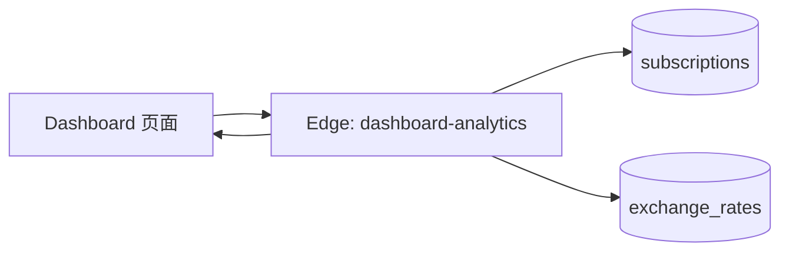
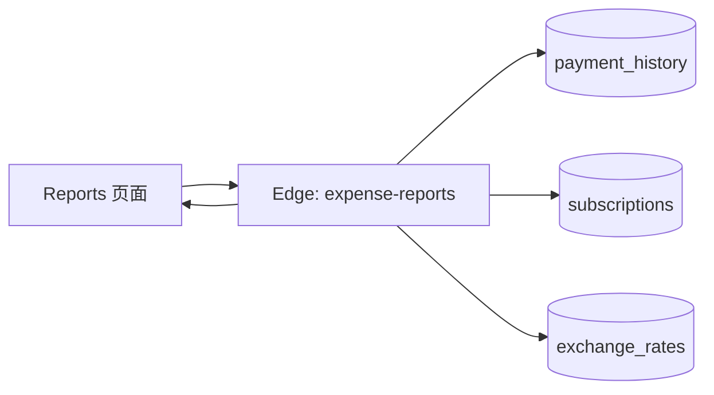
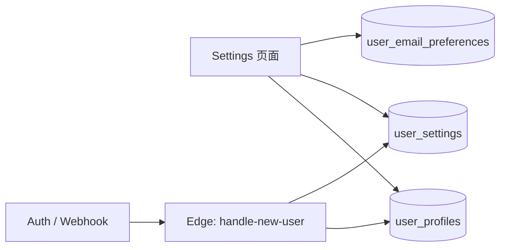
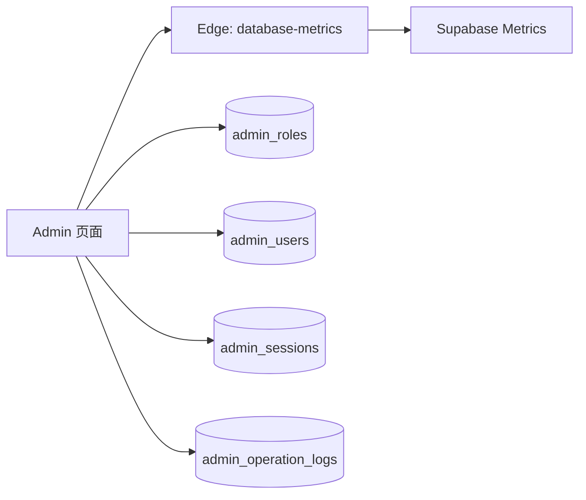

# 项目结构化说明（按功能域）

本文档按 Dashboard / Reports / Subscriptions / Settings / Admin 五大功能域，展示最小化的数据流与调用链，并列出每个域涉及的核心表、Edge Functions 与常用 API。所有图均为简化视图，仅保留主路径，避免交叉线条。

---

## Dashboard 域



- 主要数据表: `subscriptions`, `exchange_rates`
- 主要 Edge: `dashboard-analytics`
- 常用 API: 
  - Edge: POST `/functions/v1/dashboard-analytics`
  - REST: `/rest/v1/subscriptions`, `/rest/v1/exchange_rates`

---

## Reports 域



- 主要数据表: `payment_history`, `subscriptions`, `exchange_rates`
- 主要 Edge: `expense-reports`
- 返回: 月/季/年 `expenseInfo` 与 `categoryExpenses`
- 常用 API:
  - Edge: POST `/functions/v1/expense-reports`
  - REST: `/rest/v1/payment_history`, `/rest/v1/subscriptions`, `/rest/v1/exchange_rates`

---

## Subscriptions 域

```mermaid
graph LR
  FE[Subscriptions 页面] --> F1[Edge: subscriptions-management (RPC)]
  F1 --> SUBS[(subscriptions)]
  F1 --> FE
  FE -. 手动续费 .-> RPC[RPC: process_subscription_renewal]
  RPC --> PH[(payment_history)]
  RPC --> SUBS
```

- 主要数据表: `subscriptions`, `categories`, `payment_methods`, `payment_history`
- 主要 Edge: `subscriptions-management`（内部调用 RPC: `get_managed_subscriptions`）
- 主要 RPC: `process_subscription_renewal(subscription_id, user_id)`（防重复计费、原子更新）
- 常用 API:
  - Edge: POST `/functions/v1/subscriptions-management`
  - REST: `/rest/v1/subscriptions`, `/rest/v1/categories`, `/rest/v1/payment_methods`, `/rest/v1/payment_history`
  - RPC: `/rest/v1/rpc/process_subscription_renewal`

---

## Settings 域



- 主要数据表: `user_profiles`, `user_settings`, `user_email_preferences`
- 主要 Edge: `handle-new-user`（用户首次注册时初始化资料/设置）
- 常用 API:
  - REST: `/rest/v1/user_profiles`, `/rest/v1/user_settings`, `/rest/v1/user_email_preferences`
  - Edge: POST `/functions/v1/handle-new-user`（由 Database Webhook 触发）

---

## Admin 域



- 主要数据表: `admin_roles`, `admin_users`, `admin_sessions`, `admin_operation_logs`
- 主要 Edge: `database-metrics`（解析 Supabase Metrics 为结构化指标）
- 常用 API:
  - Edge: GET `/functions/v1/database-metrics`
  - REST: `/rest/v1/admin_roles`, `/rest/v1/admin_users`, `/rest/v1/admin_sessions`, `/rest/v1/admin_operation_logs`

---

## 附：跨域能力与约束
- **RLS 策略**: 用户仅能访问自身数据；默认 `categories` / `payment_methods` 对匿名可读；`exchange_rates` 认证可读、仅 `service_role` 可写；管理员表经 `is_admin_user()` / `has_admin_permission()` 控制。
- **邮件/通知**: Edge `send-welcome-email`, `send-notification-email`（可选 Resend）；表 `email_templates`, `email_logs`, `email_queue`, `user_notifications`, `notification_templates`。
- **汇率更新**: Edge `update-exchange-rates` 拉取 TianAPI，写入 `exchange_rates` 并记录 `exchange_rate_update_logs`，历史由触发器归档至 `exchange_rate_history`。

> 说明：以上图示为最小主路径，实际前端会在服务层组合调用，并按需携带筛选、分页与联表 `select`。如需扩展到具体页面组件/服务文件清单，可在此文档基础上按模块继续细化。
