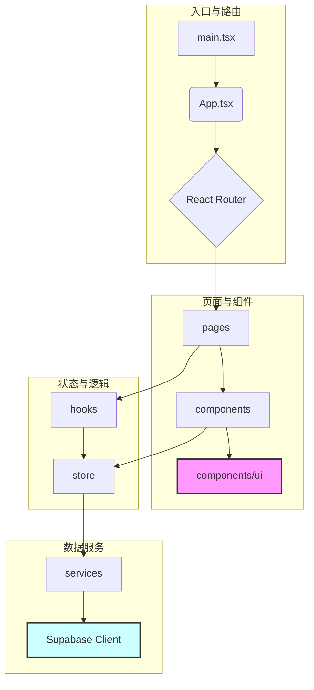
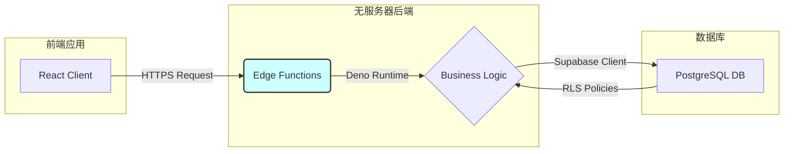

# 项目结构与代码关联详解

本文档旨在提供一个全面、深入的项目结构视图，详细说明了各个目录和关键文件职责，并阐明了它们之间的核心关联关系，同时整合了 API 请求映射，以帮助开发者快速理解项目的数据流和代码组织方式。

## 1. 顶层目录结构概览

```
/
├── .github/            # GitHub Actions CI/CD 工作流配置
├── .vscode/            # VSCode 编辑器特定设置
├── docs/               # 项目文档，包括设计、架构和本文件
├── public/             # 静态资源，如 favicon, logos 等
├── scripts/            # 自动化脚本 (例如：部署、测试)
├── src/                # 前端应用核心源代码 (React + TypeScript)
├── supabase/           # Supabase 后端配置和 Edge Functions
├── tests/              # 端到端 (E2E) 测试 (Playwright)
├── .gitignore          # Git 忽略文件配置
├── package.json        # 项目依赖和脚本定义
├── tsconfig.json       # TypeScript 编译器配置
└── vite.config.ts      # Vite 构建工具配置
```

---

## 2. 核心目录详解与关联关系

### 2.1. `src` - 前端核心

这是前端应用的根目录，所有面向用户的界面、逻辑和状态管理都在这里实现。

#### **Mermaid 图：`src` 目录核心关联**



#### **目录结构与说明**

*   **`main.tsx`**: **项目入口文件**。负责初始化 React 应用，设置 `ThemeProvider` (主题)、`BrowserRouter` (路由) 和 `QueryClientProvider` (数据请求)，并将根组件 `App.tsx` 渲染到 DOM 中。

*   **`App.tsx`**: **应用根组件**。定义了全局的路由结构，使用 `react-router-dom` 将不同的 URL 路径映射到对应的页面组件 (`src/pages`)。它还可能包含全局布局组件（如导航栏、页脚）。

*   **`pages/`**: **页面级组件**。每个文件代表应用中的一个完整页面，例如 `HomePage.tsx`、`SubscriptionsPage.tsx`。
    *   **关联关系**: 页面组件是业务逻辑的聚合点。它们通过调用自定义 **Hooks (`src/hooks`)** 来获取和管理数据，然后将数据传递给可复用的 **原子组件 (`src/components`)** 进行渲染。

*   **`components/`**: **可复用组件**。
    *   `components/ui/`: **基础 UI 组件**。由 `shadcn/ui` 提供，如 `Button.tsx`, `Card.tsx`, `Input.tsx`。这些是构成应用界面的基础积木，不包含业务逻辑。
    *   `components/dashboard/`, `components/subscription/` 等: **业务组件**。这些是与特定业务功能相关的复合组件，例如 `SubscriptionCard.tsx`。它们接收 `props` 并展示数据，可能会有自己的内部状态，但核心业务逻辑和数据请求由 `pages` 和 `hooks` 处理。

*   **`hooks/`**: **自定义 Hooks**。这是封装和复用业务逻辑的核心。例如 `useDashboardData.ts` 封装了所有获取仪表盘数据的逻辑，包括加载状态、错误处理和最终数据的返回。
    *   **关联关系**: Hooks 是连接 **页面 (`pages`)** 和 **数据服务 (`services`)** 的桥梁。它们调用 `services` 中的函数来与后端 API 交互，并使用 **状态管理 (`store`)** 来缓存和分发数据。

*   **`store/`**: **全局状态管理 (Zustand)**。
    *   `subscriptionStore.ts`, `settingsStore.ts`: 定义了不同的状态“切片”。它们负责管理全局共享的数据（如订阅列表、用户设置），并实现了**前端缓存机制**（请求去重、时效性缓存、本地持久化）。
    *   **关联关系**: `store` 是应用的“单一数据源”。**Hooks** 和 **组件** 可以订阅 store 中的状态变化来自动更新 UI。当数据需要更新时，**Hooks** 或 **Services** 会调用 store 中定义的 `actions`。

*   **`services/`**: **API 服务层**。
    *   **职责**: 封装所有与后端 API 的通信细节。每个 service 文件对应一个或一组相关的 API 端点，例如 `supabaseSubscriptionService.ts` 负责所有与订阅相关的数据库操作。
    *   **关联关系**: 这是前端与后端的边界。**Hooks** 调用 `services` 中的函数，而 `services` 内部使用 **Supabase 客户端 (`lib/supabase.ts`)** 来构造和发送 HTTP 请求。这种分层使得 API 的变更可以被隔离在 `services` 层，而无需修改业务逻辑。

*   **`lib/`**: **核心库与工具**。
    *   `supabase.ts`: 初始化并导出全局唯一的 Supabase 客户端实例。
    *   `utils.ts`: 存放通用的辅助函数，如日期格式化、货币转换等。

*   **`types/`**: **TypeScript 类型定义**。存放共享的类型和接口，如 `Subscription`, `UserProfile` 等，确保了整个应用的数据类型安全。

### 2.2. `supabase` - 后端核心

此目录包含了所有后端逻辑，完全基于 Supabase 的能力构建。

#### **Mermaid 图：`supabase` 目录核心关联**



#### **目录结构与说明**

*   **`functions/`**: **Edge Functions**。
    *   **职责**: 每个子目录代表一个独立的、可通过 HTTPS 调用的无服务器函数。这些函数使用 Deno 和 TypeScript 编写，处理需要安全环境或复杂计算的后端逻辑。
    *   **示例**:
        *   `dashboard-analytics/index.ts`: 计算仪表盘的统计数据。
        *   `subscriptions-management/index.ts`: 处理复杂的订阅数据查询、关联和格式化。
    *   **关联关系**: 前端的 **Services (`src/services`)** 层会直接调用这些 Edge Functions 的 URL。函数内部使用 Supabase 的 Admin 客户端连接到数据库，执行查询，并返回处理后的 JSON 数据。

*   **`migrations/`**: **数据库迁移脚本**。
    *   **职责**: 存放 SQL 文件，用于定义和修改数据库的表结构 (schema)。Supabase CLI 使用这些文件来保持本地开发环境和云端生产环境的数据库结构同步。

---

## 3. API 请求映射与数据流

本节整合自 `@docs/API_REQUEST_MAPPING.md`，并与代码结构关联，展示了端到端的数据流。

### 3.1. 核心数据流：获取仪表盘数据

1.  **用户访问**: 用户打开首页，`HomePage.tsx` 组件被渲染。
2.  **触发 Hook**: `HomePage.tsx` 调用 `useDashboardData()` Hook。
3.  **调用 Service**: `useDashboardData` Hook 内部调用 `dashboardEdgeFunctionService.ts` 中的函数。
4.  **请求 Edge Function**: `dashboardEdgeFunctionService` 向 Supabase 后端的 `/functions/v1/dashboard-analytics` 发起一个 `POST` 请求。
5.  **后端处理**: `supabase/functions/dashboard-analytics/index.ts` 文件中的代码被执行。它连接到数据库，进行复杂的数据聚合计算（如计算总支出、即将到期的订阅等）。
6.  **返回数据**: Edge Function 将计算结果以 JSON 格式返回。
7.  **状态更新**: `useDashboardData` Hook 接收到数据，并将其更新到 `useSubscriptionStore` (如果适用) 或自身的组件状态中。
8.  **UI 渲染**: `HomePage.tsx` 从 Hook 中获取到最终数据，并将其传递给 `StatCard.tsx`, `UpcomingRenewals.tsx` 等子组件进行展示。

### 3.2. API 请求映射表

#### **认证 (Auth)**

| API 端点 (由 Supabase JS 库封装) | 前端调用位置 (`src`) | 后端处理 |
| :--- | :--- | :--- |
| `supabase.auth.getUser()` | `services/authService.ts` | Supabase Auth Engine |
| `supabase.auth.signInWith...()` | `components/auth/SignInForm.tsx` | Supabase Auth Engine |

#### **Edge Functions (核心业务逻辑)**

| API 端点 (`POST`) | 前端 Service (`src/services`) | Edge Function (`supabase/functions`) | 页面/Hook (`src`) |
| :--- | :--- | :--- | :--- |
| `/functions/v1/dashboard-analytics` | `dashboardEdgeFunctionService.ts` | `dashboard-analytics/index.ts` | `pages/HomePage.tsx` via `useDashboardData` |
| `/functions/v1/subscriptions-management` | `subscriptionsEdgeFunctionService.ts` | `subscriptions-management/index.ts` | `pages/SubscriptionsPage.tsx` via `useSubscriptionsData` |
| `/functions/v1/expense-reports` | `expenseReportsEdgeFunctionService.ts` | `expense-reports/index.ts` | `pages/ExpenseReportsPage.tsx` via `useExpenseReportsData` |

#### **数据库 REST API (简单 CRUD)**

| API 端点 (`GET`, `POST`, etc.) | 前端 Service (`src/services`) | 数据库表 | 页面/Hook (`src`) |
| :--- | :--- | :--- | :--- |
| `/rest/v1/user_profiles` | `userProfileService.ts` | `user_profiles` | `components/user/UserProfileForm.tsx` |
| `/rest/v1/user_settings` | `supabaseUserSettingsService.ts` | `user_settings` | `store/settingsStore.ts` |
| `/rest/v1/categories` | `supabaseCategoriesService.ts` | `categories` | `store/subscriptionStore.ts` |

---

## 4. 总结

本项目的架构设计清晰，前后端职责分明：

*   **前端 (`src`)** 采用现代化的 React 技术栈，通过分层（Pages -> Hooks -> Services -> Store）和组件化，实现了高度模块化和可维护的代码结构。
*   **后端 (`supabase`)** 充分利用了 Supabase 的 PaaS 能力，通过 Edge Functions 处理复杂业务，通过数据库迁移管理数据结构，实现了稳定、可扩展的无服务器架构。
*   **数据流** 通过定义清晰的 API 接口（无论是 Edge Function 还是 REST API）在前后端之间顺畅流转，并通过前端的缓存和服务层进行优化。

这份文档为理解整个项目的运作方式提供了坚实的基础。
