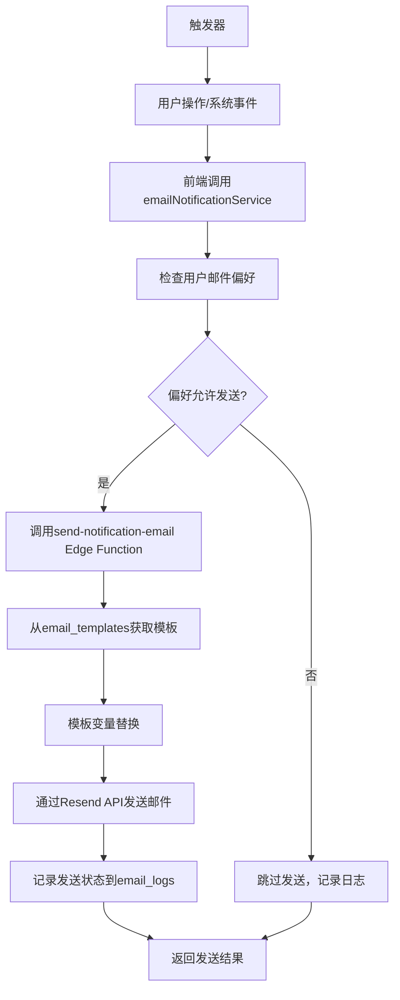

# 邮件通知系统完整分析报告

## 📋 概述

本文档详细分析了订阅管理项目中的邮件通知功能，包括数据库表结构、Edge Functions、前端组件和服务，以及完整的邮件发送流程。

## 📊 数据库表结构

### 1. 核心邮件相关表

#### `email_templates` - 邮件模板表
- **用途**: 存储各种邮件类型的模板
- **状态**: ✅ 活跃使用
- **关键字段**:
  - `template_key` - 模板唯一标识
  - `subject_template` - 邮件主题模板
  - `html_template` - HTML邮件内容模板
  - `text_template` - 纯文本邮件内容模板
  - `is_active` - 模板是否激活

#### `email_logs` - 邮件发送日志表
- **用途**: 记录所有邮件发送状态和历史
- **状态**: ✅ 活跃使用
- **关键字段**:
  - `user_id` - 用户ID
  - `email_address` - 收件人邮箱
  - `email_type` - 邮件类型
  - `status` - 发送状态 (pending/sent/failed/delivered/bounced/complained)
  - `external_email_id` - 外部邮件服务ID
  - `sent_at` - 发送时间

#### `user_email_preferences` - 用户邮件偏好设置表
- **用途**: 控制用户接收邮件的类型和频率
- **状态**: ✅ 活跃使用
- **关键字段**:
  - `user_id` - 用户ID
  - `email_type` - 邮件类型
  - `enabled` - 是否启用该类型邮件
  - `frequency` - 发送频率 (immediate/daily/weekly/never)

### 2. 通知相关表（与邮件系统分离）

#### `user_notifications` - 用户通知表
- **用途**: 应用内通知系统
- **状态**: ✅ 独立的通知系统

#### `notification_templates` - 通知模板表
- **用途**: 应用内通知模板
- **状态**: ✅ 独立的通知系统

#### `user_notification_preferences` - 用户通知偏好设置表
- **用途**: 应用内通知偏好设置
- **状态**: ⚠️ **存在冗余，建议删除**
- **问题**: 与`user_email_preferences`功能重叠，实际邮件系统使用后者

## 🔧 Edge Functions

### 1. 主要邮件服务函数

#### `send-notification-email/` - 通用邮件发送服务
- **文件**: `supabase/functions/send-notification-email/index.ts`
- **功能**: 
  - 支持8种邮件类型：
    - `welcome` - 欢迎邮件
    - `subscription_expiry` - 订阅到期提醒
    - `payment_failed` - 支付失败通知
    - `payment_success` - 支付成功确认
    - `quota_warning` - 配额警告
    - `security_alert` - 安全警告
    - `system_update` - 系统更新通知
    - `password_reset` - 密码重置邮件
  - 集成Resend API发送邮件
  - 自动记录发送状态到`email_logs`表
  - 支持模板变量替换
  - 支持自定义模板覆盖

#### `send-welcome-email/` - 专用欢迎邮件发送服务
- **文件**: `supabase/functions/send-welcome-email/index.ts`
- **功能**:
  - 专门处理新用户注册后的欢迎邮件
  - 可作为独立函数调用或作为通用服务的特例
  - 从数据库获取用户信息
  - 支持开发环境邮件预览

## 📱 前端组件和服务

### 1. 核心服务

#### `emailNotificationService.ts` - 邮件通知主服务
- **文件**: `src/services/emailNotificationService.ts`
- **功能**:
  - 提供各种邮件发送方法
  - 管理用户邮件偏好设置
  - 获取邮件发送日志和统计
  - 条件发送邮件（检查用户偏好）

**主要方法**:
- `sendNotification()` - 通用邮件发送
- `sendWelcomeEmail()` - 发送欢迎邮件
- `sendSubscriptionExpiryReminder()` - 发送订阅到期提醒
- `sendPaymentFailedNotification()` - 发送支付失败通知
- `sendPaymentSuccessConfirmation()` - 发送支付成功确认
- `getUserEmailLogs()` - 获取用户邮件日志
- `getUserEmailPreferences()` - 获取用户邮件偏好
- `updateEmailPreferences()` - 更新邮件偏好
- `isEmailTypeEnabled()` - 检查邮件类型是否启用
- `sendNotificationIfEnabled()` - 条件发送邮件

### 2. UI组件

#### `EmailPreferencesForm.tsx` - 邮件偏好设置表单
- **文件**: `src/components/user/EmailPreferencesForm.tsx`
- **功能**:
  - 用户界面管理邮件通知偏好
  - 按类别分组显示邮件类型
  - 支持启用/禁用特定邮件类型
  - 支持设置邮件频率
  - 实时保存和重置功能

#### `EmailLogsViewer.tsx` - 邮件发送日志查看器
- **文件**: `src/components/user/EmailLogsViewer.tsx`
- **功能**: 显示用户的邮件发送历史和状态

#### `UserPreferencesForm.tsx` - 用户偏好设置
- **文件**: `src/components/user/UserPreferencesForm.tsx`
- **功能**: 包含邮件设置在内的综合用户偏好管理

## 🔄 邮件发送完整流程



### 详细流程步骤:

1. **触发器** → 用户操作（注册、支付等）或系统事件（订阅到期等）
2. **服务调用** → 前端调用`emailNotificationService`相应方法
3. **偏好检查** → 检查用户在`user_email_preferences`中的设置
4. **Edge Function** → 调用`send-notification-email`函数
5. **模板获取** → 从`email_templates`表获取对应模板
6. **变量替换** → 将动态数据填入模板变量
7. **邮件发送** → 通过Resend API实际发送邮件
8. **状态记录** → 将发送结果记录到`email_logs`表
9. **结果返回** → 返回发送成功/失败状态

## ❗ 冗余表分析

### `user_notification_preferences`表冗余问题

**分析结果**:
- ❌ **存在冗余**: 与`user_email_preferences`功能重叠
- 📍 **使用位置**: 仅在`src/services/notificationService.ts`中有少量引用
- 🎯 **实际使用**: 邮件系统实际使用`user_email_preferences`表

**功能对比**:
| 表名 | 用途 | 状态 | 使用情况 |
|------|------|------|----------|
| `user_notification_preferences` | 应用内通知偏好 | 冗余 | 很少使用 |
| `user_email_preferences` | 邮件通知偏好 | 活跃 | 广泛使用 |

## 📋 清理建议

### 1. 可以安全删除的冗余表
- ✅ `user_notification_preferences` - 功能被`user_email_preferences`完全替代

### 2. 保留的邮件核心表
- ✅ `email_templates` - 活跃使用，邮件模板管理
- ✅ `email_logs` - 活跃使用，发送日志追踪
- ✅ `user_email_preferences` - 活跃使用，用户偏好控制

### 3. 清理操作步骤

1. **检查依赖**:
   ```bash
   # 搜索所有对user_notification_preferences的引用
   grep -r "user_notification_preferences" src/
   ```

2. **创建迁移脚本**:
   ```sql
   -- 删除冗余表
   DROP TABLE IF EXISTS user_notification_preferences CASCADE;
   
   -- 清理相关索引（如果存在）
   DROP INDEX IF EXISTS idx_user_notification_preferences_user_id;
   DROP INDEX IF EXISTS idx_user_notification_preferences_type;
   
   -- 清理相关RLS策略
   -- 清理相关触发器
   ```

3. **更新代码**:
   - 检查`src/services/notificationService.ts`
   - 移除对已删除表的引用
   - 如需要，迁移到`user_email_preferences`

## 🎯 系统现状总结

### ✅ 优势
- **架构完整**: 包含模板、日志、偏好的完整邮件系统
- **功能丰富**: 支持8种不同类型的邮件通知
- **用户控制**: 用户可以精细控制邮件接收偏好
- **日志完备**: 详细记录所有邮件发送状态
- **前端友好**: 提供完整的UI管理界面
- **API集成**: 集成Resend等专业邮件服务

### ⚠️ 需要改进
- **数据冗余**: `user_notification_preferences`表需要清理
- **代码整合**: 通知系统和邮件系统可以进一步整合

### 📈 建议优化
1. **立即执行**: 清理冗余表`user_notification_preferences`
2. **中期规划**: 整合通知系统和邮件系统的管理界面
3. **长期优化**: 考虑添加邮件模板的可视化编辑器

## 📝 相关文件清单

### Edge Functions
- `supabase/functions/send-notification-email/index.ts`
- `supabase/functions/send-welcome-email/index.ts`

### 前端服务
- `src/services/emailNotificationService.ts`
- `src/services/notificationService.ts`

### UI组件
- `src/components/user/EmailPreferencesForm.tsx`
- `src/components/user/EmailLogsViewer.tsx`
- `src/components/user/UserPreferencesForm.tsx`

### 数据库
- `supabase/migrations/000_database_schema.sql` (邮件相关表定义)

---

## 🚀 统一通知系统重构方案

基于前面的分析，我们设计了一个完整的统一通知系统重构方案，解决模板表合并、定时任务缺失、用户偏好统一管理等核心问题。

## 🎯 核心问题解决方案

### 1. **模板表合并** ✅
**决策：合并 `notification_templates` 和 `email_templates` 为 `unified_notification_templates`**

**设计要点：**
- 添加 `channel_type` 字段区分通知渠道（email/sms/push/in_app）
- 支持模板继承和变量替换
- 默认以email为主要渠道，但支持多渠道扩展

### 2. **定时任务系统** ✅  
**决策：构建完整的定时通知调度系统**

**设计要点：**
- 利用Supabase的pg_cron扩展
- 基于 `user_settings` 表的notifications配置动态判断
- 支持相对时间触发（如"订阅到期前7天"）

### 3. **统一偏好管理** ✅
**决策：重新设计用户通知偏好系统**

**设计要点：**
- 统一管理所有通知渠道的偏好设置  
- 支持细粒度控制（通知类型 + 渠道 + 频率）
- 与user_settings深度整合

## 🏗️ 完整系统架构重构

### 📊 数据库表重构

```sql
-- 1. 统一通知模板表（合并原有两个模板表）
CREATE TABLE unified_notification_templates (
  id UUID PRIMARY KEY DEFAULT gen_random_uuid(),
  template_key TEXT NOT NULL UNIQUE,
  name TEXT NOT NULL,
  channel_type TEXT NOT NULL CHECK (channel_type IN ('email', 'sms', 'push', 'in_app')),
  notification_type TEXT NOT NULL,
  priority TEXT DEFAULT 'normal',
  
  -- 模板内容（根据渠道类型使用不同字段）
  subject_template TEXT, -- 邮件/短信标题
  html_template TEXT,    -- 邮件HTML内容  
  text_template TEXT,    -- 纯文本内容
  push_title TEXT,       -- 推送标题
  push_body TEXT,        -- 推送内容
  
  -- 配置
  variables JSONB,       -- 可用变量列表
  is_active BOOLEAN DEFAULT true,
  created_at TIMESTAMPTZ DEFAULT NOW(),
  updated_at TIMESTAMPTZ DEFAULT NOW()
);

-- 2. 通知渠道配置表
CREATE TABLE notification_channels (
  id UUID PRIMARY KEY DEFAULT gen_random_uuid(),
  channel_type TEXT NOT NULL UNIQUE,
  name TEXT NOT NULL,
  is_enabled BOOLEAN DEFAULT true,
  config JSONB, -- API密钥、发送限制等配置
  created_at TIMESTAMPTZ DEFAULT NOW()
);

-- 3. 重新设计的用户通知偏好表
CREATE TABLE user_notification_preferences_v2 (
  id UUID PRIMARY KEY DEFAULT gen_random_uuid(),
  user_id UUID NOT NULL REFERENCES auth.users(id) ON DELETE CASCADE,
  notification_type TEXT NOT NULL,
  channel_type TEXT NOT NULL,
  enabled BOOLEAN DEFAULT true,
  frequency TEXT DEFAULT 'immediate' CHECK (frequency IN ('immediate', 'daily', 'weekly', 'never')),
  quiet_hours_start TIME,
  quiet_hours_end TIME,
  created_at TIMESTAMPTZ DEFAULT NOW(),
  updated_at TIMESTAMPTZ DEFAULT NOW(),
  UNIQUE(user_id, notification_type, channel_type)
);

-- 4. 通知队列表（支持延迟发送和重试）
CREATE TABLE notification_queue (
  id UUID PRIMARY KEY DEFAULT gen_random_uuid(),
  user_id UUID NOT NULL REFERENCES auth.users(id) ON DELETE CASCADE,
  template_key TEXT NOT NULL,
  channel_type TEXT NOT NULL,
  recipient TEXT NOT NULL, -- 邮箱、手机号等
  
  -- 内容
  subject TEXT,
  content JSONB, -- 渲染后的内容
  variables JSONB, -- 模板变量
  
  -- 调度
  scheduled_at TIMESTAMPTZ DEFAULT NOW(),
  priority TEXT DEFAULT 'normal',
  max_retries INTEGER DEFAULT 3,
  retry_count INTEGER DEFAULT 0,
  
  -- 状态
  status TEXT DEFAULT 'pending' CHECK (status IN ('pending', 'processing', 'sent', 'failed', 'cancelled')),
  sent_at TIMESTAMPTZ,
  failed_reason TEXT,
  
  created_at TIMESTAMPTZ DEFAULT NOW()
);

-- 5. 统一通知日志表（替代email_logs）
CREATE TABLE notification_logs (
  id UUID PRIMARY KEY DEFAULT gen_random_uuid(),
  user_id UUID NOT NULL REFERENCES auth.users(id) ON DELETE CASCADE,
  notification_type TEXT NOT NULL,
  channel_type TEXT NOT NULL,
  recipient TEXT NOT NULL,
  
  -- 内容快照
  subject TEXT,
  content_preview TEXT, -- 内容预览（前100字符）
  
  -- 发送状态
  status TEXT NOT NULL CHECK (status IN ('sent', 'failed', 'delivered', 'opened', 'clicked', 'bounced', 'complained')),
  external_id TEXT, -- 外部服务返回的ID
  error_message TEXT,
  
  -- 统计
  sent_at TIMESTAMPTZ DEFAULT NOW(),
  delivered_at TIMESTAMPTZ,
  opened_at TIMESTAMPTZ,
  clicked_at TIMESTAMPTZ,
  
  -- 元数据
  metadata JSONB,
  created_at TIMESTAMPTZ DEFAULT NOW()
);

-- 6. 定时通知调度表
CREATE TABLE notification_schedules (
  id UUID PRIMARY KEY DEFAULT gen_random_uuid(),
  name TEXT NOT NULL,
  notification_type TEXT NOT NULL,
  template_key TEXT NOT NULL,
  
  -- 调度配置
  schedule_type TEXT NOT NULL CHECK (schedule_type IN ('cron', 'relative', 'fixed')),
  cron_expression TEXT, -- 如 '0 9 * * *' 每天9点
  relative_trigger TEXT, -- 如 'subscription_expires_in_7_days'
  fixed_datetime TIMESTAMPTZ,
  
  -- 条件
  conditions JSONB, -- 触发条件（如用户设置检查）
  target_users TEXT DEFAULT 'all', -- 'all' 或特定用户组
  
  is_active BOOLEAN DEFAULT true,
  created_at TIMESTAMPTZ DEFAULT NOW(),
  updated_at TIMESTAMPTZ DEFAULT NOW()
);

-- 7. 通知规则表（复杂条件判断）
CREATE TABLE notification_rules (
  id UUID PRIMARY KEY DEFAULT gen_random_uuid(),
  name TEXT NOT NULL,
  notification_type TEXT NOT NULL,
  
  -- 规则配置
  conditions JSONB NOT NULL, -- 复杂的JSON条件
  actions JSONB NOT NULL,    -- 满足条件时的动作
  
  priority INTEGER DEFAULT 0,
  is_active BOOLEAN DEFAULT true,
  created_at TIMESTAMPTZ DEFAULT NOW()
);
```

### 🔧 服务层架构重构

```typescript
// 1. 统一通知服务
class UnifiedNotificationService {
  async sendNotification(request: NotificationRequest): Promise<NotificationResult>
  async scheduleNotification(request: ScheduleRequest): Promise<void>
  async checkUserPreferences(userId: string, type: string): Promise<PreferenceSettings>
  async processQueue(): Promise<void>
}

// 2. 通知渠道接口
interface NotificationChannel {
  send(notification: NotificationData): Promise<SendResult>
  validate(config: ChannelConfig): boolean
  getDeliveryStatus(externalId: string): Promise<DeliveryStatus>
}

class EmailChannel implements NotificationChannel {
  // Resend API集成
}

class SMSChannel implements NotificationChannel {
  // 短信服务集成
}

class PushChannel implements NotificationChannel {
  // 推送通知集成
}

class InAppChannel implements NotificationChannel {
  // 应用内通知
}

// 3. 定时任务调度器
class NotificationScheduler {
  async processScheduledTasks(): Promise<void>
  async evaluateRelativeTriggers(): Promise<void>
  async checkUserSettings(userId: string, rules: Rule[]): Promise<boolean>
}

// 4. 规则引擎
class NotificationRuleEngine {
  async evaluateRules(context: RuleContext): Promise<RuleResult[]>
  async checkUserSettingsConditions(userId: string, conditions: any): Promise<boolean>
}
```

### ⏰ 定时任务实现

```sql
-- 创建定时任务处理函数
CREATE OR REPLACE FUNCTION process_scheduled_notifications()
RETURNS void AS $$
BEGIN
  -- 处理订阅到期提醒
  INSERT INTO notification_queue (user_id, template_key, channel_type, recipient, variables, scheduled_at)
  SELECT 
    s.user_id,
    'subscription_expiry_reminder',
    'email',
    u.email,
    json_build_object(
      'subscription_name', s.name,
      'expiry_date', s.next_billing_date,
      'days_left', (s.next_billing_date - CURRENT_DATE)
    ),
    NOW()
  FROM subscriptions s
  JOIN auth.users u ON s.user_id = u.id
  JOIN user_settings us ON s.user_id = us.user_id
  WHERE s.next_billing_date BETWEEN CURRENT_DATE + INTERVAL '7 days' AND CURRENT_DATE + INTERVAL '8 days'
    AND s.is_active = true
    AND us.settings->>'notifications'->>'subscription_expiry_enabled' = 'true'
    AND NOT EXISTS (
      SELECT 1 FROM notification_logs nl 
      WHERE nl.user_id = s.user_id 
        AND nl.notification_type = 'subscription_expiry' 
        AND nl.sent_at > CURRENT_DATE
    );
    
  -- 处理支付失败重试提醒
  INSERT INTO notification_queue (user_id, template_key, channel_type, recipient, variables, scheduled_at)
  SELECT 
    ph.user_id,
    'payment_retry_reminder',
    'email',
    u.email,
    json_build_object(
      'subscription_name', s.name,
      'amount', ph.amount,
      'currency', ph.currency,
      'retry_count', ph.retry_count
    ),
    NOW()
  FROM payment_history ph
  JOIN subscriptions s ON ph.subscription_id = s.id
  JOIN auth.users u ON ph.user_id = u.id
  JOIN user_settings us ON ph.user_id = us.user_id
  WHERE ph.status = 'failed'
    AND ph.created_at > CURRENT_DATE - INTERVAL '24 hours'
    AND ph.retry_count < 3
    AND us.settings->>'notifications'->>'payment_retry_enabled' = 'true'
    AND NOT EXISTS (
      SELECT 1 FROM notification_logs nl 
      WHERE nl.user_id = ph.user_id 
        AND nl.notification_type = 'payment_retry'
        AND nl.sent_at > CURRENT_DATE - INTERVAL '6 hours'
    );
END;
$$ LANGUAGE plpgsql;

-- 设置定时任务（每天9点执行）
SELECT cron.schedule('process-notifications', '0 9 * * *', 'SELECT process_scheduled_notifications();');

-- 创建队列处理函数
CREATE OR REPLACE FUNCTION process_notification_queue()
RETURNS void AS $$
BEGIN
  -- 处理待发送的通知
  UPDATE notification_queue 
  SET status = 'processing'
  WHERE status = 'pending' 
    AND scheduled_at <= NOW()
    AND retry_count < max_retries;
END;
$$ LANGUAGE plpgsql;

-- 每分钟处理一次队列
SELECT cron.schedule('process-queue', '* * * * *', 'SELECT process_notification_queue();');
```

### 📱 前端服务重构

```typescript
// 统一通知服务
export class UnifiedNotificationService {
  // 发送通知（检查用户偏好）
  async sendNotificationIfAllowed(request: NotificationRequest): Promise<NotificationResult> {
    const preferences = await this.getUserPreferences(request.userId, request.type)
    
    if (!this.shouldSendNotification(preferences, request)) {
      return { success: true, message: 'Notification blocked by user preferences' }
    }
    
    return this.sendNotification(request)
  }

  // 用户偏好检查
  private shouldSendNotification(preferences: UserPreferences, request: NotificationRequest): boolean {
    // 检查通知类型是否启用
    if (!preferences[request.type]?.enabled) return false
    
    // 检查渠道偏好
    if (!preferences[request.type]?.channels?.includes(request.channel)) return false
    
    // 检查频率限制
    if (!this.checkFrequencyLimit(preferences, request)) return false
    
    // 检查静默时间
    if (this.isInQuietHours(preferences)) return false
    
    // 检查user_settings中的通知开关
    if (!this.checkUserSettingsPermission(request.userId, request.type)) return false
    
    return true
  }

  // 检查user_settings中的通知权限
  private async checkUserSettingsPermission(userId: string, notificationType: string): Promise<boolean> {
    const { data: userSettings } = await supabase
      .from('user_settings')
      .select('settings')
      .eq('user_id', userId)
      .single()
    
    const notifications = userSettings?.settings?.notifications || {}
    return notifications[`${notificationType}_enabled`] !== false
  }

  // 批量发送优化
  async sendBatchNotifications(requests: NotificationRequest[]): Promise<BatchResult> {
    const grouped = this.groupByChannelAndTemplate(requests)
    const results = []
    
    for (const [key, group] of grouped) {
      const result = await this.sendChannelBatch(group)
      results.push(result)
    }
    
    return { results, totalSent: results.reduce((sum, r) => sum + r.sent, 0) }
  }

  // 调度延迟通知
  async scheduleNotification(request: ScheduleNotificationRequest): Promise<void> {
    await supabase
      .from('notification_queue')
      .insert({
        user_id: request.userId,
        template_key: request.templateKey,
        channel_type: request.channelType,
        recipient: request.recipient,
        variables: request.variables,
        scheduled_at: request.scheduledAt,
        priority: request.priority || 'normal'
      })
  }
}

// 通知规则引擎
export class NotificationRuleEngine {
  async evaluateUserSettingsRules(userId: string, notificationType: string): Promise<boolean> {
    const { data: userSettings } = await supabase
      .from('user_settings')
      .select('settings')
      .eq('user_id', userId)
      .single()
    
    const notifications = userSettings?.settings?.notifications || {}
    
    // 检查全局通知开关
    if (notifications.enabled === false) return false
    
    // 检查邮件通知开关
    if (notifications.email_notifications_enabled === false) return false
    
    // 检查特定类型通知开关
    const typeKey = `${notificationType}_enabled`
    if (notifications[typeKey] === false) return false
    
    return true
  }
}
```

## 🚀 三阶段实施计划

### 第一阶段：基础重构（2-3周）
1. **数据表创建和迁移**
   - 创建新的统一表结构
   - 迁移现有邮件模板和日志数据
   - 保持向后兼容

2. **核心服务重构**
   - 实现UnifiedNotificationService
   - 重构EmailChannel
   - 更新前端组件调用

### 第二阶段：定时任务和规则引擎（2-3周）
1. **定时任务系统**
   - 实现NotificationScheduler
   - 创建订阅到期提醒等定时任务
   - 集成user_settings条件判断

2. **规则引擎**
   - 实现复杂条件判断
   - 支持基于用户行为的智能通知

### 第三阶段：高级功能和优化（3-4周）
1. **智能功能**
   - 通知去重和频率控制
   - A/B测试支持
   - 多渠道扩展（SMS、Push等）

2. **性能优化**
   - 批量处理优化
   - 异步处理优化
   - 队列处理机制完善

## 📊 监控和运维

### 关键指标监控
- 通知发送成功率、延迟、错误率
- 各渠道转化率和用户参与度  
- 用户取消订阅率和投诉情况
- 队列处理性能和积压情况

### 用户体验优化
- 智能发送时间推荐
- 基于历史行为的个性化内容
- 实时反馈收集和分析

### 数据迁移安全保障
1. **渐进式迁移策略**
   - 保持现有系统运行，逐步迁移功能
   - 新老系统并行一段时间，确保稳定性
   - 提供回滚机制

2. **数据完整性保护**
   - 创建完整数据备份
   - 逐步迁移用户偏好设置
   - 保持email_logs等关键数据的完整性

## 🔒 安全性考虑
- 通知内容敏感信息脱敏
- API访问控制和权限管理
- 用户数据隐私保护合规
- 防止通知滥发和垃圾信息

## 💡 重构优势

### ✅ 解决的核心问题
1. **模板管理统一**: 合并冗余的模板表，支持多渠道
2. **定时任务完善**: 补全缺失的定时通知功能
3. **偏好管理统一**: 整合所有通知渠道的用户偏好
4. **与user_settings集成**: 深度整合用户设置和通知规则

### ✅ 新增的高级功能
1. **多渠道支持**: Email/SMS/Push/应用内通知
2. **智能调度**: 基于时间、事件和用户行为的智能通知
3. **队列处理**: 支持延迟发送、重试和批量处理
4. **规则引擎**: 复杂条件判断和个性化通知

### ✅ 架构优势
1. **可扩展性**: 模块化设计，易于添加新的通知渠道
2. **可维护性**: 统一的接口和清晰的职责分离
3. **性能优化**: 批量处理、队列机制和异步处理
4. **监控完善**: 详细的日志和指标监控

---

*最后更新: 2025-08-21*
*分析人: Claude Code*
*重构方案设计: Claude Code*