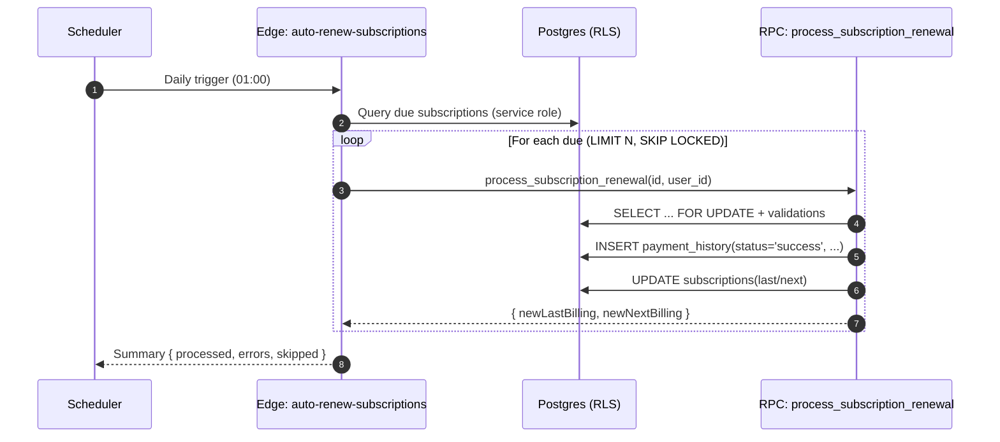

# 技术方案（Subscription Automatic Renewal）

## 架构与组件
- 数据库（Postgres + RLS）
  - 表：`subscriptions`, `payment_history`, `user_settings`, 可选 `system_logs/system_stats`
  - RPC：`process_subscription_renewal(subscription_id uuid, user_id uuid)`（已存在）
- Edge Functions
  - 新增：`auto-renew-subscriptions`（服务角色运行，定时/手动触发）
- 前端
  - 仍使用现有手动续费入口；自动续费不需 UI 交互，仅展示结果

## 数据与约束
- 续费筛选条件
  - `renewal_type='auto' AND status='active' AND next_billing_date <= CURRENT_DATE`
- 支付记录
  - `status='success'`（与现有 check 约束一致）
  - `billing_period_start=today`，`billing_period_end=周期末日`
- 幂等
  - 依赖 RPC 对 `next_billing_date` 的校验（不能大于 today）+ 行锁避免重复

## 时序流程


## SQL/RPC 设计
- 修复与增强 `process_subscription_renewal`
  - 将 `payment_history.status` 改为 `'success'`
  - 在读取订阅时加行级锁：`SELECT ... FOR UPDATE`
  - 保留现有“若 `next_billing_date > today` 则拒绝”的防重复逻辑

## Edge Function：auto-renew-subscriptions
- 入口参数（可选）：`limit`（单批处理条数，默认 100）
- 逻辑：
  1. 以 service role 查询 due 列表：
     - `SELECT id, user_id FROM subscriptions WHERE renewal_type='auto' AND status='active' AND next_billing_date <= CURRENT_DATE ORDER BY next_billing_date ASC LIMIT $limit FOR UPDATE SKIP LOCKED`
     - 注：直接在 Edge 端查询可不加锁；若迁移至 SQL 批量过程，可在 SQL 内加 `FOR UPDATE SKIP LOCKED`
  2. 逐条调用 RPC，收集结果
  3. 统计 processed/errors/skipped 并返回
  4. 可选：写 `system_stats` 计数、`system_logs` 错误明细

## 并发与幂等
- 防重复策略：
  - RPC 内 `SELECT ... FOR UPDATE` 保证同一时刻单订阅仅有一线程处理
  - 校验 `next_billing_date > today` → 拒绝重复续费
  - Edge 支持小批量循环，避免长事务
- 重试安全：
  - 失败可重试，不会产生重复支付（由幂等校验保障）

## 权限与 RLS
- Edge 使用 service role 查询 due 列表
- RPC 为 SECURITY DEFINER：
  - 函数内部按 `id + user_id` 精确匹配，非当前用户数据直接拒绝
- 客户端手动续费沿用现有 `supabaseSubscriptionService.manualRenewSubscription`

## 错误处理与监控
- 每条错误收集原因（SQL exception message）
- 批次返回 `{ processed, errors, skipped }`
- 可选：
  - `system_logs`: 记录错误详情
  - `system_stats`: 增量计数（今日成功/失败）

## 配置与调度
- 定时：每日 01:00（Asia/Shanghai）
- 运行环境：Edge Functions（Deno）
- 速率限制：按批次 `limit=100`，循环直至无更多 due（设置最大批次数防长跑）

## 测试策略
- 单元测试
  - 计费周期计算（月/季/年），月底/闰年
  - `isSubscriptionDue`/日期比较边界
- 集成测试（Staging）
  - 构造 due/非 due、manual/auto、active/cancelled/trial
  - 重试触发与并发触发（模拟多进程）
  - 校验 `payment_history` 与 `subscriptions` 更新一致性
- 回归
  - Dashboard/Reports 数据展示与统计不受影响

## 风险与缓解
- 重复计费风险 → 行锁 + `next_billing_date` 校验
- 长批次阻塞 → 分批 + 限流 + 循环退出条件
- 数据漂移（手工改表） → 使用约束校验；监控异常率

## 里程碑
1. 修复 RPC 与加锁
2. 实现 Edge `auto-renew-subscriptions`（手动触发）
3. 接入定时任务与监控
4. 完成集成测试与灰度

---

## 生产方案（首选：DB 内批处理 + pg_cron）

### 方案概述
- 不依赖 HTTP 调用，全部在数据库内完成：稳定、低延迟、失败面小、原子性强。
- 每日定时通过 `pg_cron` 调用批处理 SQL 函数 `util.process_due_auto_renewals(limit)`。
- 函数内部按批处理并使用 `FOR UPDATE SKIP LOCKED` 加锁逐条续费；失败不中断，汇总统计。

### 扩展与准备
- 确认已启用：`pg_cron`（调度）、`pg_net`（如需 HTTP 备选）
- 无需 Vault（本方案不调用 HTTP）；如启用备选方案再使用 Vault 存储密钥。

### 批处理函数（示例骨架）
```sql
create schema if not exists util;

create or replace function util.process_due_auto_renewals(p_limit int default 500)
returns jsonb
language plpgsql
security definer
as $$
declare
  v_processed int := 0;
  v_errors int := 0;
  v_skipped int := 0;
  r record;
begin
  -- 分批扫描到期且自动续费的订阅，行级锁避免并发重复
  for r in (
    select id, user_id
    from public.subscriptions
    where renewal_type = 'auto'
      and status = 'active'
      and next_billing_date <= current_date
    order by next_billing_date asc
    limit p_limit
    for update skip locked
  ) loop
    begin
      -- 复用既有 RPC，内部再校验 next_billing_date，确保幂等
      perform process_subscription_renewal(r.id, r.user_id);
      v_processed := v_processed + 1;
    exception when others then
      v_errors := v_errors + 1;
      -- 可选写入系统日志表
      insert into public.system_logs(id, log_type, message, metadata, created_at)
      values (gen_random_uuid(), 'auto_renew_error', sqlerrm,
              jsonb_build_object('subscription_id', r.id, 'user_id', r.user_id), now());
    end;
  end loop;

  -- 可选：写入统计
  insert into public.system_stats(id, stat_type, stat_value, metadata, recorded_at)
  values (gen_random_uuid(), 'auto_renew_processed', v_processed, '{}', now());

  return jsonb_build_object('processed', v_processed, 'errors', v_errors, 'skipped', v_skipped);
end;
$$;
```

注意
- `process_subscription_renewal` 内需修正 `payment_history.status='success'` 且在读取时 `SELECT ... FOR UPDATE`。
- 单次批量 `limit` 建议 100~1000；若剩余更多到期记录，可由 `pg_cron` 次日继续或循环调度（避免超长事务）。

### 定时调度（每天 01:00）
```sql
select cron.schedule(
  'auto-renew-daily',
  '0 1 * * *',
  $$ select util.process_due_auto_renewals(500); $$
);

-- 修改/停用
select cron.alter_job(
  job_id := (select jobid from cron.job where jobname = 'auto-renew-daily'),
  active := false
);
```

### 监控与回滚
- 监控：`system_stats` 每日处理量；`system_logs` 错误明细；必要时仪表盘展示。
- 回滚：`cron.alter_job(..., active := false)` 立即停用；或将 `p_limit` 调小作为“限流”。

---

## 备选方案（DB 调度 + HTTP 调 Edge）
- 使用 `pg_cron + pg_net.http_post` 定时调用 Edge Function（已在上文提供示例）。
- 优点：逻辑集中在 Edge；适合跨服务集成；便于手动/管理员触发。
- 缺点：新增 HTTP/鉴权与网络失败面；相比 DB 内方案更复杂。
